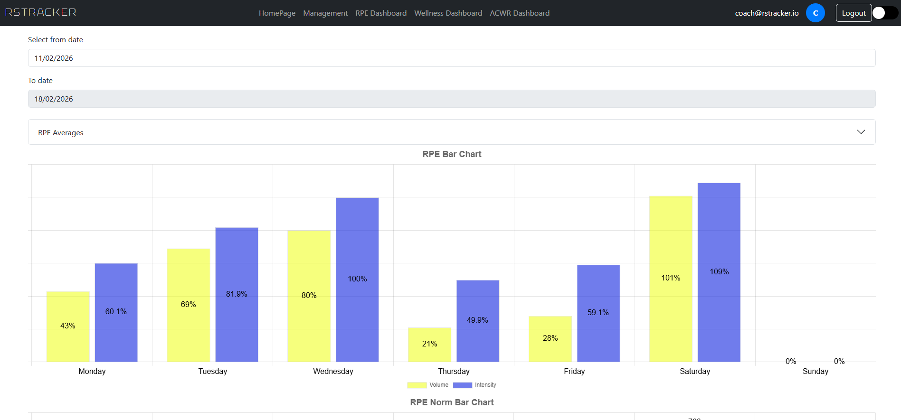
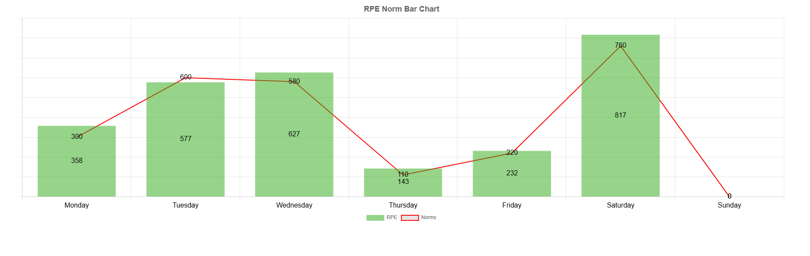
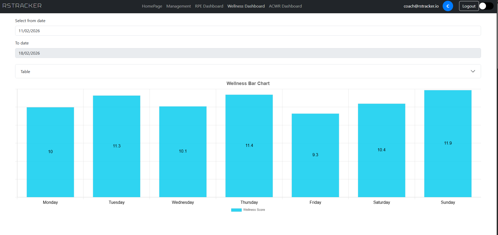
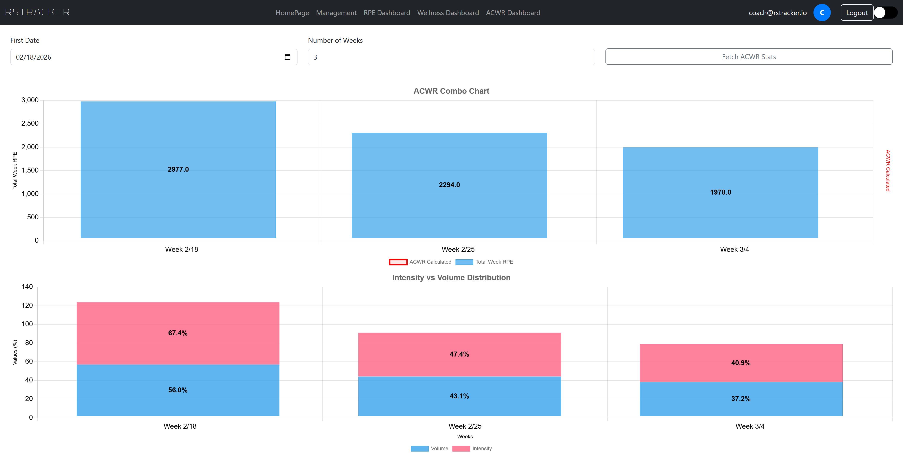
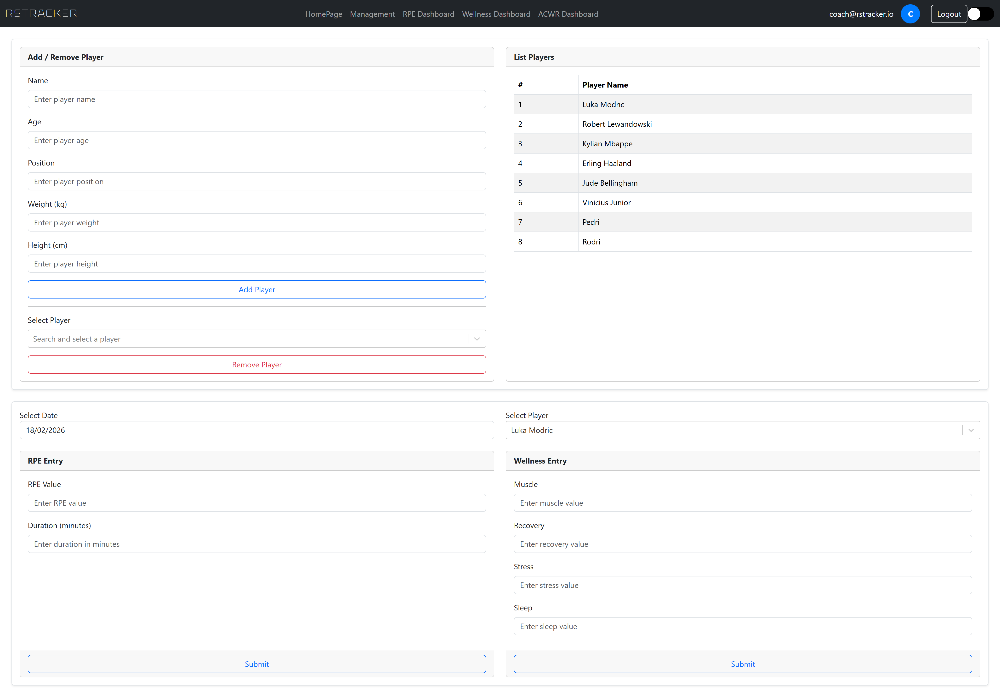
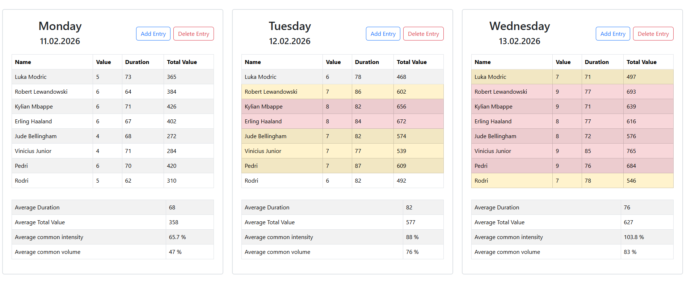

# RSTracker

RSTracker helps coaching staff make data-driven decisions about player load management. By tracking daily RPE (Rating of Perceived Exertion) and wellness scores across a squad, the application calculates key performance indicators such as training load volume, intensity, and the Acute:Chronic Workload Ratio (ACWR) -- a widely recognized metric for assessing injury risk.

The platform is designed around the concept of **league weeks** (7-day windows), allowing staff to review and compare data on a week-by-week basis aligned with the competitive schedule.

---

## Key Features

**Player Management**
- Maintain a full squad roster with player profiles (name, age, position, weight, height)
- Add and remove players with cascading data cleanup

**RPE Tracking**
- Record daily session RPE values and training duration per player
- Automatic calculation of session training load (RPE x duration)
- Daily team averages, volume percentages, and intensity metrics
- Comparison against built-in reference norms for each day of the week

**Wellness Monitoring**
- Track four daily wellness dimensions per player: Muscle Status, Recovery Status, Stress, and Sleep
- Each dimension scored on a 1-7 scale (total wellness score out of 28)
- Mid-week recovery assessment via Wednesday-Thursday-Friday averages

**ACWR Analysis**
- Acute:Chronic Workload Ratio calculation over configurable time windows
- Multi-week trend visualization to identify periods of elevated injury risk
- Combined volume and intensity breakdown per week

**Data Visualization**
- Bar charts for daily wellness and RPE summaries
- Combo charts comparing actual RPE loads against daily reference norms
- Stacked bar charts for weekly RPE breakdowns across the ACWR period
- ACWR ratio trend charts spanning multiple weeks

**Weekly Data Views**
- Day-by-day tables showing individual player values alongside team averages
- Week summary tables with aggregated statistics
- Date picker navigation to browse historical data by league week

---

## Screenshots

*RPE Bar Chart -- daily training load visualization*

*RPE Norm Chart -- actual loads compared against daily reference norms*

*Wellness Chart -- daily wellness score overview*

*ACWR Analysis -- workload ratio trends across multiple weeks*

*Player Management -- squad roster administration*

*Player Data, RPE, Wellness and Management -- combined data entry view*

---

## Sports Science Background

#### RPE (Rating of Perceived Exertion)

RPE is a subjective measure of how hard a player perceives a training session to be. When combined with session duration, it produces the **session RPE** or total training load:

$$\text{Session RPE} = \text{RPE Value} \times \text{Duration (minutes)}$$

#### Volume and Intensity

- **Volume** is expressed as a percentage of the maximum expected daily load (baseline of 760):

$$\text{Volume} = \frac{\text{Total RPE}}{760} \times 100$$

- **Intensity** normalizes volume by time to account for differences in session length:

$$\text{Intensity} = \frac{\text{Volume}}{\text{Common Time} / 95}$$

#### Wellness Scoring

Players self-report four metrics daily, each on a 1-7 scale:

| Metric | Description |
|---|---|
| Muscle Status | Perceived muscle soreness and readiness |
| Recovery Status | General sense of physical recovery |
| Stress | Mental and emotional stress levels |
| Sleep | Sleep quality and duration |

The total wellness score ranges from 4 to 28. The platform also calculates a **Wednesday-Thursday-Friday average**, commonly used to assess recovery state heading into match day.

#### ACWR (Acute:Chronic Workload Ratio)

The ACWR compares the current week's training load against the rolling average of the previous four weeks:

$$ACWR = \frac{\text{Current Week Load}}{\text{Average of Previous 4 Weeks}}$$

| ACWR Range | Interpretation |
|---|---|
| Below 0.8 | Undertraining -- potential detraining risk |
| 0.8 - 1.3 | Safe zone -- optimal load management |
| 1.3 - 1.5 | Caution -- elevated injury risk |
| Above 1.5 | Danger zone -- high injury risk |

#### Daily Reference Norms

The system includes built-in daily RPE norms for a typical training week to compare against actual loads:

| Day | Mon | Tue | Wed | Thu | Fri | Sat | Sun |
|---|---|---|---|---|---|---|---|
| Reference RPE | 300 | 600 | 580 | 110 | 220 | 760 | 0 |

---

## Technology Stack

#### Frontend

| Technology | Purpose |
|---|---|
| React 19 | UI framework |
| Vite | Build tool and dev server |
| React Router DOM | Client-side routing |
| React Bootstrap / Bootstrap 5 | UI component library and styling |
| Chart.js + react-chartjs-2 | Data visualization and charting |
| chartjs-plugin-datalabels | Chart label overlays |
| MSAL React + MSAL Browser | Microsoft Entra ID authentication |
| date-fns | Date manipulation and formatting |
| react-datepicker | Date selection component |
| react-select | Enhanced dropdown selects |
| react-toastify | Toast notifications |
| react-spinners | Loading indicators |

#### Backend

| Technology | Purpose |
|---|---|
| .NET 9 / ASP.NET Core | Web API framework |
| Entity Framework Core 9 | ORM and database migrations |
| PostgreSQL (via Npgsql) | Relational database |
| JWT Bearer Authentication | API security |
| Swashbuckle / Swagger | API documentation |
| Newtonsoft.Json | JSON serialization |
| Azure Key Vault | Secrets management |
| Azure Blob Storage | Structured operation logging |
| In-Memory Cache | Response caching with TTL-based invalidation |

#### Infrastructure

| Technology | Purpose |
|---|---|
| Docker | Containerization with multi-stage builds |
| Nginx | Frontend reverse proxy and SPA routing |
| Azure Container Apps | Cloud hosting |
| Azure Key Vault | Centralized secrets management |
| Azure Blob Storage | Append-style daily log files |

#### Testing

| Technology | Purpose |
|---|---|
| xUnit | Test framework |
| Testcontainers | Integration testing with real PostgreSQL instances |

---

## CI/CD

The project uses **GitHub Actions** for continuous integration and deployment. A workflow is triggered on every push to the `main` branch and performs the following steps:

1. **Test** -- restores .NET dependencies, pulls a PostgreSQL image, and runs the full xUnit test suite (including Testcontainers-based integration tests)
2. **Build** -- builds Docker images for both the backend (ASP.NET Core API) and frontend (React SPA served by Nginx), tagged with the short commit hash
3. **Push** -- pushes both images to Docker Hub
4. **Deploy** -- authenticates with Azure and updates both Azure Container Apps (backend and frontend) to use the newly built images

This ensures that every merge to `main` is automatically tested, containerized, and deployed to production.

---

## Authentication

RSTracker uses **Microsoft Entra ID** (formerly Azure Active Directory) for authentication.

- Users log in through a browser redirect flow via the Microsoft identity platform
- The frontend acquires an access token using MSAL (Microsoft Authentication Library) with the configured API scope
- Every API request includes the token in the `Authorization: Bearer {token}` header
- The backend validates the JWT against the configured Azure AD tenant and audience
- All API endpoints are protected -- unauthenticated requests receive a 401 response

---

## Testing

The test suite uses **xUnit** with **Testcontainers** to spin up real PostgreSQL instances during integration tests, ensuring database operations are tested against actual database behavior rather than mocks.

Test coverage includes:

| Test File | Coverage |
|---|---|
| PlayerHelperTests | Player CRUD operations and data retrieval |
| RPEManagerTests | RPE calculations, weekly aggregation, volume, and intensity |
| WelnessManagerTests | Wellness scoring, weekly summaries, and mid-week averages |

Azure Blob Storage logging is mocked during tests to isolate database-focused assertions.

---

## License

All rights reserved.
